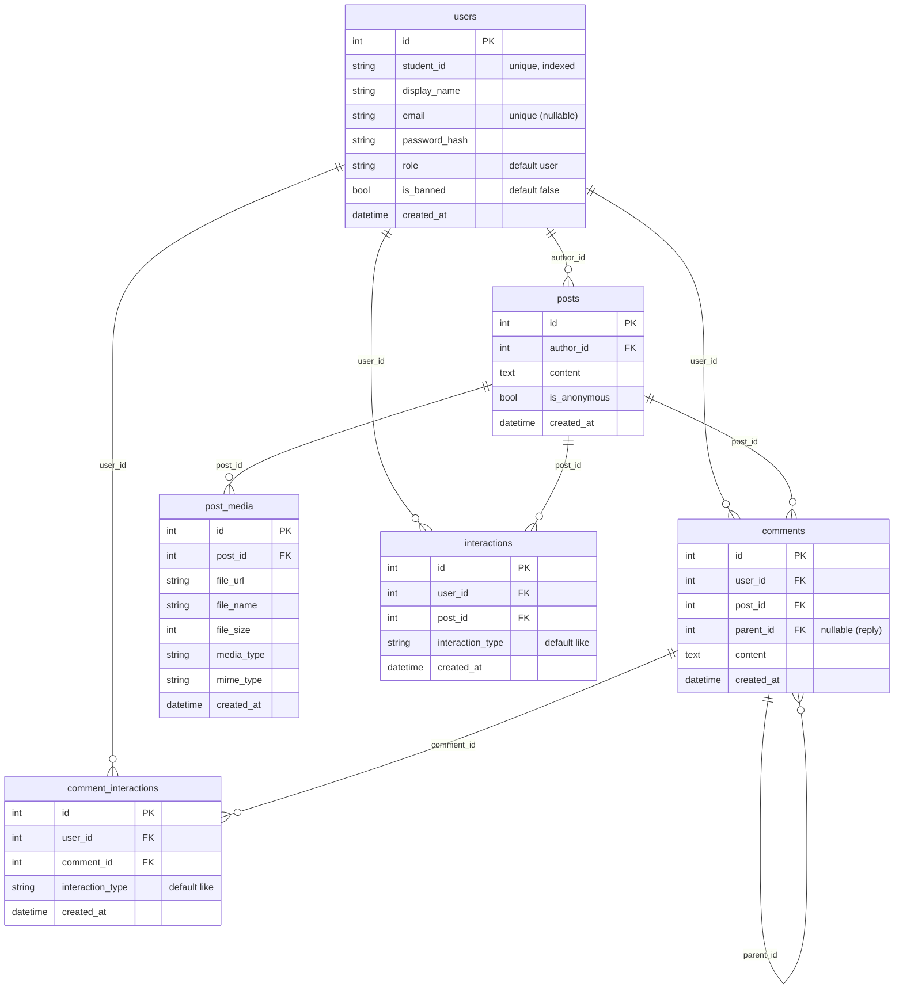

# DTU Confession (Full-Stack) - Technical Report

Thoi diem khao sat: 2026-03-17. Repo: `DTU_Confession/` (FastAPI + React/Vite + PostgreSQL + Docker/Nginx).

## 1) Kien truc he thong

### 1.1 So do tong quan (deployment voi Docker Compose)

```mermaid
flowchart LR
  U[User Browser] -->|HTTP : APP_PORT (default 3000)| N[Nginx (frontend container)]
  N -->|/ (SPA)| SPA[Static assets: /usr/share/nginx/html]
  N -->|/api/* proxy_pass| B[FastAPI (backend container :8000)]
  B -->|SQLAlchemy| DB[(PostgreSQL 15 :5432)]
  B -->|local fs volume| UP[(uploads_data volume)]
  B -->|GET /api/media/files/*| U
```

Ghi chu:
- Nginx chay trong container `frontend` phuc vu SPA va proxy `/api/` sang backend.
- Backend luu media vao thu muc `backend/uploads` (mapped volume `uploads_data:/app/uploads` trong docker).

### 1.2 Cac thanh phan chinh

- Frontend: React 19, React Router, Axios (`frontend/src/api/*`).
- Backend: FastAPI (`backend/main.py`), routers (`backend/routers/*`), auth/JWT (`backend/auth.py`), ORM models (`backend/models.py`).
- Database: PostgreSQL, schema duoc tao bang `models.Base.metadata.create_all(bind=engine)` (khong thay migrations/Alembic).

## 2) Dependencies

### 2.1 Backend (`backend/requirements.txt`)

Nhom quan trong:
- API: `fastapi`, `starlette`, `uvicorn`, `python-multipart`
- ORM/DB: `SQLAlchemy`, `psycopg2-binary`
- Auth: `python-jose`, `passlib[bcrypt]`, `bcrypt`
- Config/validation: `python-dotenv`, `pydantic`, `email-validator`

### 2.2 Frontend (`frontend/package.json`)

- Core: `react`, `react-dom`, `react-router-dom`
- HTTP: `axios` (send cookies: `withCredentials: true`)
- UI: `tailwindcss`, `motion`, `lucide-react`, `react-toastify`, `sweetalert2`
- Tooling: `vite`, `@vitejs/plugin-react`, `eslint`

## 3) Database schema (SQLAlchemy Models)

Nguon: `backend/models.py`.

### 3.1 ERD (logic)



### 3.2 Constraints/Indexes dang co

- `users.student_id` unique + index; `users.email` unique (nullable).
- `posts.author_id`, `comments.user_id`, `comments.post_id`, `post_media.post_id`, `interactions.user_id`, `interactions.post_id` co index.
- Unique constraints:
  - `interactions`: (`user_id`, `post_id`, `interaction_type`) -> 1 like/post/user.
  - `comment_interactions`: (`user_id`, `comment_id`, `interaction_type`) -> 1 like/comment/user.

Thieu (de can nhac):
- Index cho `posts.created_at`, `comments.created_at` (dang order_by frequently).
- Full-text search index (neu muon search noi dung hieu qua).

## 4) API endpoints va chuc nang

Nguon: `backend/routers/*` (prefix trong tung router).

### 4.1 Authentication

- `POST /api/auth/register`: tao user (student_id unique), hash password bcrypt.
- `POST /api/auth/login`: verify password, set cookie `access_token` + `refresh_token` (HttpOnly).
- `POST /api/auth/refresh`: doc `refresh_token` cookie, cap access token moi.
- `POST /api/auth/logout`: xoa cookies.

Frontend flow:
- Axios `withCredentials: true` (`frontend/src/api/axios.js`) -> tu dong gui cookies.
- AuthContext khi mo app goi `GET /api/users/me` de lay user (`frontend/src/context/AuthContext.jsx`).

### 4.2 Posts (confession feed)

Router prefix: `POST/GET/DELETE /api/posts...` (`backend/routers/posts.py`).
- `POST /api/posts/`: tao post (can login).
- `GET /api/posts/`: list posts, ho tro `skip`, `limit`, `search`; neu co user -> tinh `user_liked`.
- `GET /api/posts/{post_id}`: chi tiet post + like/comment count.
- `DELETE /api/posts/{post_id}`: xoa post (chi author).

### 4.3 Comments (threaded)

Duong dan khong co prefix router (hard-coded full path trong file `backend/routers/comments.py`):
- `POST /api/posts/{post_id}/comments`: tao comment (can login), ho tro `parent_id`.
- `GET /api/posts/{post_id}/comments`: list comments, build cay replies in-memory.
- `DELETE /api/comments/{comment_id}`: xoa comment (chi owner).

### 4.4 Social interactions (likes)

Duong dan hard-coded (`backend/routers/interactions.py`):
- `POST /api/posts/{post_id}/like`: like post (400 neu da like).
- `DELETE /api/posts/{post_id}/like`: unlike post.
- `POST /api/comments/{comment_id}/like`: toggle like comment (like/unlike).
- `DELETE /api/comments/{comment_id}/like`: unlike comment (duplicate voi toggle logic o tren).

### 4.5 Media upload/serve

Router prefix: `/api/media` (`backend/routers/media.py`).
- `POST /api/media/upload/{post_id}`: upload file 1-shot (image/audio/video), limit 120MB, luu FS.
- `POST /api/media/upload-chunk/{post_id}`: upload chunk, ghep khi chunk cuoi, limit 120MB.
- `GET /api/media/files/{filename}`: serve file tu FS.

### 4.6 Admin (moderation co ban)

Router prefix: `/api/admin` (`backend/routers/admin.py`) - can `role=admin`.
- `GET /api/admin/users`: list/search users.
- `PUT /api/admin/users/{user_id}/role`: set role admin/user.
- `PUT /api/admin/users/{user_id}/ban?is_banned=true|false`: ban/unban.
- `DELETE /api/admin/posts/{post_id}`: xoa post bat ky.
- `DELETE /api/admin/comments/{comment_id}`: xoa comment bat ky.

### 4.7 Stats

Router prefix: `/api/stats` (`backend/routers/stats.py`).
- `GET /api/stats/`: tong posts/users/comments, posts_today.
- `GET /api/stats/top-posts`: top 5 posts liked trong 7 ngay.
- `GET /api/stats/active-users`: top 5 users co nhieu posts (khong banned).

## 5) Flow bao mat (authn/authz) va nhan dinh

### 5.1 AuthN: JWT + HttpOnly cookies

Backend:
- Tao token HS256 (`backend/auth.py`), payload chua `sub=user_id`, `exp`.
- `get_current_user` uu tien token tu `Authorization: Bearer ...`, fallback cookie `access_token`.

Frontend:
- Khong luu token o localStorage; dua vao cookie HttpOnly (`withCredentials: true`).

Nhan dinh:
- Cookie-based auth giam nguy co XSS lay token (tot), nhung can can nhac CSRF.
- `secure=True` khi set cookie trong `backend/routers/auth.py` se KHONG gui cookie tren HTTP (local dev khong HTTPS) -> de gay "dang nhap xong nhung /me van 401" neu chay thuan http://localhost. Can co che dev/prod switch.

### 5.2 AuthZ

- User endpoints: phan quyen theo `author_id` (xoa post) / `user_id` (xoa comment).
- Admin endpoints: check `role == "admin"` (`backend/auth.py:get_admin_user`).
- Ban: `get_current_user` tu choi neu `is_banned=true`.

### 5.3 Rate limiting / brute force protection

Khong thay co che rate limit, lockout, captcha, hoac audit log cho:
- Dang nhap sai nhieu lan
- Spam create post/comment/like
- Upload media lien tuc

De xuat:
- Rate limit theo IP + user_id + endpoint (vd: `/auth/login`, `/posts`, `/comments`, `/media/upload*`).
- Account lockout nhe (vd: 5 sai/10 phut) + exponential backoff.

### 5.4 CSRF

Voi cookie auth, neu deploy tren domain that, can can nhac:
- CSRF token (double submit / header token) cho cac request thay doi trang thai (POST/PUT/DELETE).
- Hoac chuyen sang Authorization header bearer token (va luu token an toan) neu team muon don gian hoa CSRF.

### 5.5 Media path traversal (quan trong)

`GET /api/media/files/{filename}` join path truc tiep va check `os.path.exists`. Neu client gui `filename=..\\..\\...` co the truy cap file ngoai `uploads` (tuy OS/path). Can normalize va block `..`, path separator, hoac chi cho phep pattern UUID + extension.

Tuong tu, `upload_id` trong chunk upload duoc dung lam thu muc con trong `.chunks/` ma khong validate.

## 6) Media storage & distribution

Hien tai:
- Luu local filesystem trong container (persist qua Docker volume).
- `file_url` duoc luu dang `/api/media/files/{unique_name}` trong DB.
- Khong co transform/thumbnail, khong co cache headers/ETag, khong co CDN.

Rui ro/han che:
- Khong scale ngang backend de dang (local volume can shared storage).
- Serve media qua FastAPI se ton worker time/IO; khong toi uu cho file lon.
- Khong scan virus/noi dung, khong strip metadata (EXIF), khong validate extension vs mime "thuc".

De xuat:
- Chuyen media sang object storage (S3/MinIO) + presigned URL; backend chi luu metadata + key.
- Neu giu local: de Nginx serve static `/uploads/` tu volume, backend chi tao record DB.
- Them cache headers (`Cache-Control`, `ETag`) cho file bat bien.
- Validate MIME bang sniffing (python-magic) va allowlist, gioi han so luong file/post.

## 7) Performance, error handling, logging

### 7.1 Query patterns

Posts listing (`backend/routers/posts.py`):
- Dem like/comment bang subquery correlate cho tung row -> de bi cham khi feed lon.
- Search dung `ilike %term%` tren `posts.content` va `users.display_name/student_id` -> can index/FTS neu data lon.

Comments listing:
- Lay toan bo comments cua post, build tree in-memory (OK cho nho, can pagination cho post nhieu comment).

### 7.2 Error handling

`backend/main.py`:
- Co handler cho validation 422, HTTPException, va Exception -> response format `{success:false, error:{code,message,details}}`.
Luu y:
- Nhieu router dang tra loi theo kieu khac nhau (vd: interactions/media tra `{success:true,...}`; auth tra user object; errors tra `detail=...`). Consistency can duoc chuan hoa de frontend de xu ly.

### 7.3 Logging/observability

Khong thay structured logging; `media.py` dung `print` + `traceback`. Chua co:
- request id / correlation id
- access log format ro rang
- metrics (p95 latency, error rate), tracing

De xuat:
- Them middleware gan `X-Request-ID`.
- Dung `logging` thay `print`, format JSON neu can.
- Them health endpoints rieng (readiness/liveness) + metrics (Prometheus).

## 8) Moderation tools & notification system

Hien co:
- Admin: ban/unban, doi role, xoa post/comment.

Chua co:
- Report/flag post/comment, queue review, shadowban, keyword filter.
- Audit log (ai ban ai, ai xoa noi dung gi, ly do).
- Notification system (in-app, email, push) cho reply/like/admin actions.

De xuat (uu tien theo gia tri):
- Them bang `reports` (post_id/comment_id, reporter_id, reason, status, created_at).
- Them bang `audit_logs` (actor_id, action, target, metadata jsonb, created_at).
- Notification: bang `notifications` + websocket (hoac long polling) neu muon realtime.

## 9) Deployment configuration

Nguon: `docker-compose.yml`, `backend/Dockerfile`, `frontend/Dockerfile`, `frontend/nginx.conf`.

Nhan dinh:
- Postgres credentials hard-coded trong compose (OK cho dev, khong OK cho prod).
- Backend set `SECRET_KEY` trong compose; can secret management cho production.
- Volume `uploads_data` giup persist media, nhung can backup/restore strategy.

## 10) Cac van de can xu ly som (prioritized)

1. Security: path traversal o `GET /api/media/files/{filename}` va `upload_id` (chunk) can validate/sanitize.
2. Cookie `secure=True` can theo moi truong (dev HTTP vs prod HTTPS) de tranh login bi "mat".
3. `.env.example` co typo `ACCESS_TOKEN_EXPRIRE_MINUTES` khong khop code (`ACCESS_TOKEN_EXPIRE_MINUTES`) -> de gay nham config.
4. Thieu rate limiting cho login, create post/comment, upload.
5. Media serving qua FastAPI co the nghen IO khi tai file lon; can offload sang Nginx/object storage.

## 11) De xuat cai tien (roadmap ngan)

- Chuan hoa response schema (thanh cong/loi) tren toan API.
- Them pagination cho comments, va ho tro cursor pagination cho feed (created_at/id).
- Them indexing/FTS: `posts(created_at)`, `comments(post_id, created_at)`, optional PostgreSQL full-text for `posts.content`.
- Them CSRF strategy neu tiep tuc cookie-based auth.
- Them report/moderation workflow + audit logs.
- Tach config dev/prod: cookie flags, CORS, secret, database URL.

